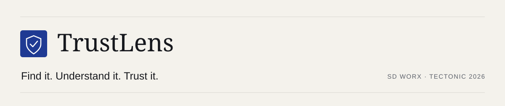
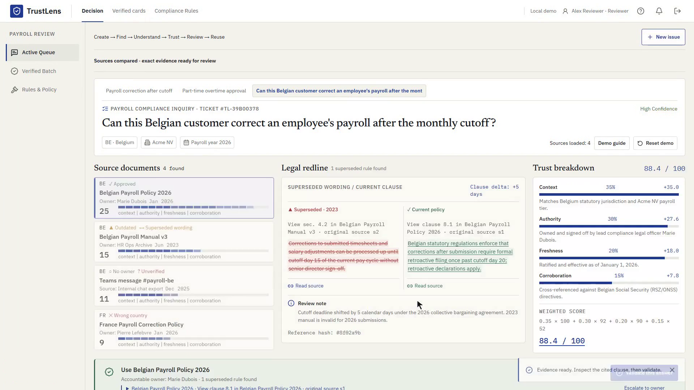
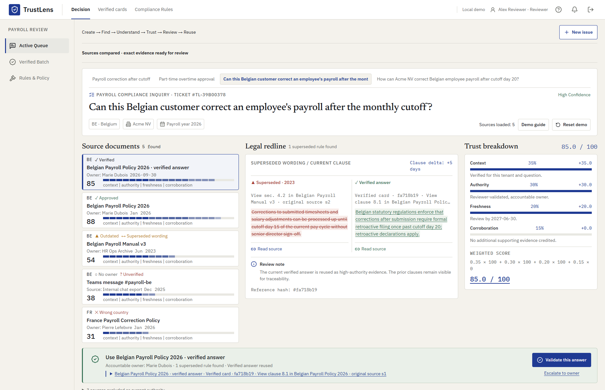
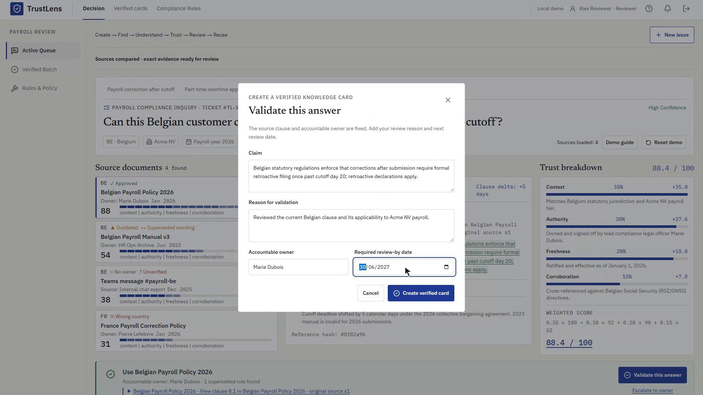
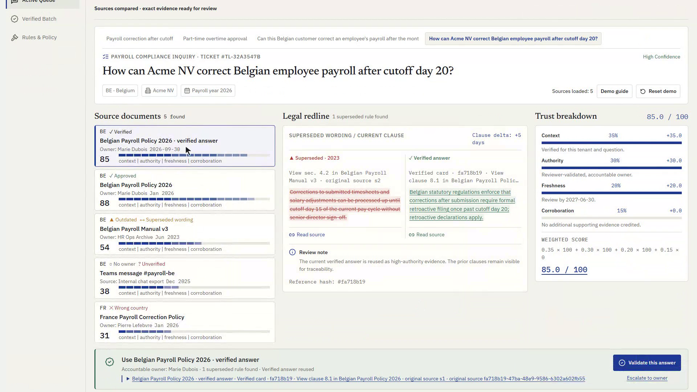

# TrustLens — Find it. Understand it. Trust it.

<div align="center">
  
  <p><strong>Evidence-backed decisions from fragmented organizational knowledge.</strong></p>
  <p>
    <a href="https://github.com/abdoutifu/trustlens/releases/download/hackathon-demo-2026/TrustLens-demo.mp4">Watch demo (1:52)</a>
    &nbsp;·&nbsp; <a href="docs/DEMO.md">Walkthrough guide</a>
    &nbsp;·&nbsp; <a href="docs/TECHNICAL.md">Implementation notes</a>
  </p>
</div>

---

## Problem

A payroll answer often lives scattered across a current policy, an outdated manual, and a Teams chat. 

When sources contradict or expire, generic AI guesses or hallucinates. Payroll and HR teams need to see exact differences, inspect evidence authority, and make accountable decisions backed by real policy evidence.

---

## Demo

- **Video Demo**: [Watch the 1:52 demo](https://github.com/abdoutifu/trustlens/releases/download/hackathon-demo-2026/TrustLens-demo.mp4)
- **Walkthrough Guide**: [docs/DEMO.md](docs/DEMO.md)
- **Demo Accounts** (pre-seeded credentials):
  - `reviewer@trustlens.demo` / `ReviewerDemo!` — Create, search, validate, escalate, resolve, and reset
  - `reader@trustlens.demo` / `ReaderDemo!` — Inspect decisions and verified cards
  - `admin@trustlens.demo` / `AdminDemo!` — All review actions plus audit trail access
- **Seeded Scenarios**:
  - **Payroll correction after cutoff**: Current Belgian policy wins (**88.4** score); outdated, wrong-country, and unverified sources are cleanly excluded.
  - **Part-time overtime approval**: Two valid sources disagree within **1.6 points**; triggers human review, owner escalation, clause resolution, and reusable card creation.

---

## Screenshots

### 1. Find Knowledge
Search tenant documents, retrieve candidate excerpts, and inspect citation coverage.


### 2. Understand Differences
Compare clauses side-by-side with legal redlines, separating superseded policies from active disagreements.


### 3. Trust Breakdown & Escalation
Inspect weighted factor contributions (Context 35%, Authority 30%, Freshness 20%, Corroboration 15%) and escalate disputes to policy owners.


### 4. Reusable Verified Knowledge
Validated decisions become verified cards with accountable owners, review-by dates, and audit history.


---

## How it works

1. **Find**: Retrieves relevant clauses from tenant documents based on country, year, and context.
2. **Understand**: Compares retrieved clauses verbatim; flags superseded rules and highlights genuine wording conflicts.
3. **Trust**: Scores sources across 4 transparent factors (Context 35%, Authority 30%, Freshness 20%, Corroboration 15%). Conflicting or insufficient evidence halts automation and requires review.
4. **Review & Reuse**: Reviewers select the applicable clause, validate with review-by dates, and publish verified cards for future queries.

---

## Tech

- **Frontend**: React 19, TypeScript, Vite, Tailwind CSS, Lucide icons
- **Backend / Store**: Node.js, Express, in-memory domain store with tenant isolation
- **AI Integration**: OpenAI Structured Outputs for clause extraction & comparison (server-side only; sample decisions work fully offline without an API key)
- **Testing**: 45 automated tests covering scoring, tenant isolation, roles, validation bounds, expiry, and audit chains

---

## Security

- **Strict Tenant Isolation**: Enforced at the service boundary for all questions, sources, cards, and audit entries.
- **Fail-Closed Architecture**: AI compares excerpts, but deterministic application rules enforce scoring, authority eligibility, and citations. Invalid sources cannot corroborate.
- **Zero API Key Leakage**: OpenAI credentials stay strictly on the local backend; no client-exposed `VITE_` keys.
- **Tamper-Evident Audit**: Append-only audit chain with SHA-256 hash linkage per ticket.
- **Scope**: Local hackathon prototype with in-memory fixtures; production would integrate enterprise identity and persistent database storage.

---

## Run

### Quick start
Requires Node.js **20.19+ or 22.12+**.

```sh
npm install
npm run dev
```

Open **http://127.0.0.1:5173**. Seeded sample decisions work immediately without an API key.

### Optional: Live OpenAI comparison
Copy `.env.example` to `.env` and set `OPENAI_API_KEY`:

```dotenv
OPENAI_API_KEY=your_key_here
OPENAI_MODEL=gpt-4.1-mini
```

### Verification & tests

```sh
npm test
npm run typecheck
npm run build
```
